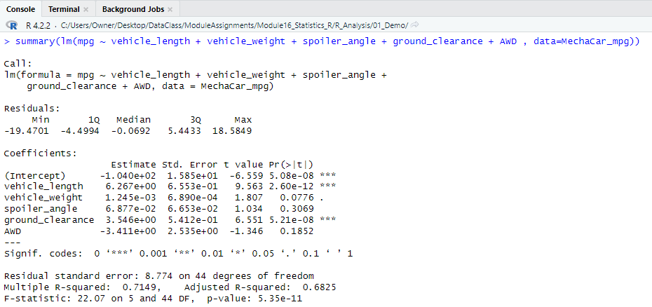
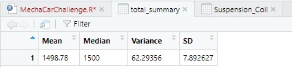
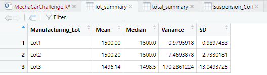
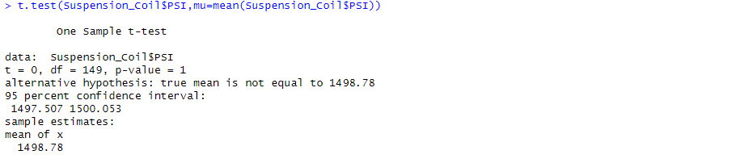
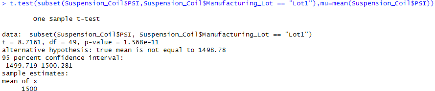
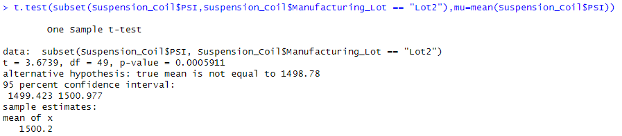
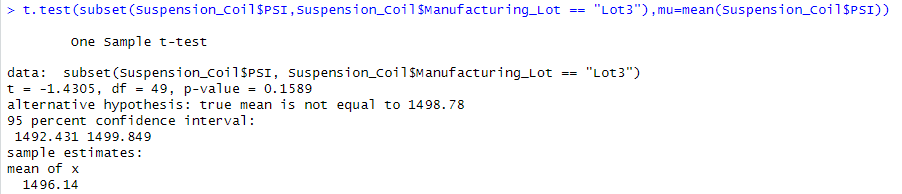

# MechaCar_Statistical_Analysis

## Objective
In this challenge we are assisting the AutosRus data analytics team to review production data for insights that may help the manufucturing team overcome troubles encountered by their newest prototype, the MechaCar.

These activities include the following:
- Linear regression analysis to predict mpg
- Statistics on Suspension Coils/PSI
- Comparison of manufacturing lots vs the mean population
- A study design to futher compare MechaCar vehicles against vehicles from other manufactures

### Linear Regression to Predict MPG

**After completing the linear regression analysis, AutoRus requested a response to the following questions.**

Q1. Which variables/coefficients provided a non-random amount of variance to the mpg values in the dataset?

*A1. The strongest contributors of non-random variances include:*
*- Vehicle length - p-value 2.60e-12*
*- Ground clearance - p-value 5.21e-08*

Q2. Is the slope of the linear model considered to be zero? Why or why not?

*A2. The slope of the linear model is not zero as vehicle length, ground clearance and AWD are coefficients that contain non-zero values.

Q3. Does this linear model predict mpg of MechaCar prototypes effectively? Why or why not?

*A3. The r-squared value of 0.7149 indicates the model had good predictive power for mpg.

### Summary Statistics on Suspension Coilds

**After completing the summary statistics, AutoRus requested we address the following question.

Q1. The design specifications for the MechaCar suspension coils dictate that the variance of the suspension coils must not exceed 100 pounds per square inch. Does the current manufacturing data meet this design specticiation for all manufacturing lots in total and each lot individually? Why or why not?

*A1. Although the total summary indicates a variance of 62.29356 which falls within the allowed threshold, it is imperative that each lot is reviewed individually.  Here, we see concern especially in Lot Three, which indicates a variance of 170 PSI and therefore does not meet the maximum variance requirement.

### T-Tests on Suspension Coils

**After completing the summary and lot tests on the suspension coils, AutoRus requested we summarize our interpretation and finding for the results, which follow.

* dd

### Design Study Comparing the MechaCar to the Competition

**In addition to assisting with the above analytics, AutoRus requested we design a statistical study to compare performances of the MechaCar vehichles against performance of vehicles against other manufacturers.  A few metrics that would be of interest to a consumer include cost, city/highway fuel efficiency, horsepower, maintenance or saftey ratings.  Upon completion the following questions should be answered:

Q1. What metric or metrics are you going to test?

*A1. 

Q2. What is the null hypothesis or alternative hypothesis?

*Q2.

Q3. What statistical test would you use to test the hypothesis? And why?

*A3.

Q4. What data is needed to run the statistical test?

*A4.

